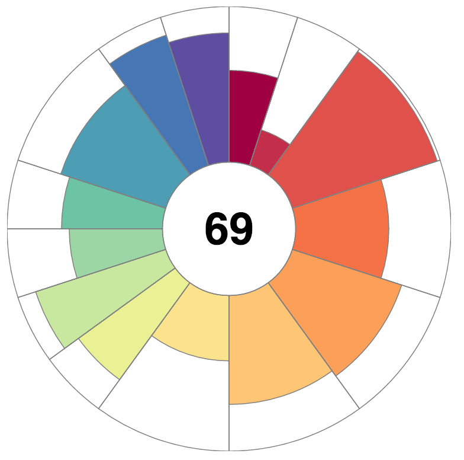

# Radial Information Visualization

## Local Development

Browsers enforce strict security permissions to prevent you from reading files out of the local file system.

To develop locally, you must run a local web server rather than using `file://…`.

Node's [http-server](https://www.npmjs.com/package/http-server) is recommended.

### Install

`npm install -g http-server`

### Run

`http-server &` 

This will start the server on [http://localhost:8080](http://localhost:8080/) from the current working directory.

## Tasks

1. Change the number of slices;

2. Change the legend;

3. Change the score of the slices for another scenario (eg.: the radial is the set of information of a football player, as dribbling, passing, set pieces).

See [slide 14](https://github.com/FMCalisto/radial-infoVis/blob/master/workshop/Are%20you%20HIPEd%20about%20exploring%20information.pptx) of the presentation.
